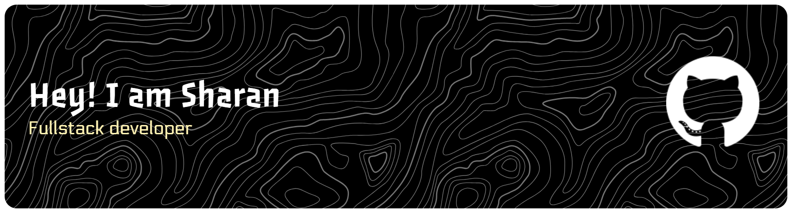

# 👋 Hey, I'm Sharan B

### Developer • Builder • Problem Solver

Creating practical tools, automation systems, AI applications, and productivity software.

---

## 🚀 About Me

- 💻 Passionate about Software Development
- 🤖 Interested in AI and Automation
- 🛠️ Building useful real-world applications
- 📚 Constantly learning new technologies
- 🎯 Focused on creating tools that improve productivity

---

## 🔥 Current Projects

### RemGestureControl
Control and automate your PC using mouse gestures and custom commands.

### RemFolderControl
AI-powered file organization and retrieval system.

### RemBrain
Personal knowledge and productivity operating system.

### RemStudio
AI-powered creator workspace and media asset manager.

### RemCheatControl
Plugin-based command launcher inspired by game cheat consoles.

---

## 🛠️ Tech Stack

### Languages

### Tools

---

## 📈 GitHub Stats

  
  

---

## 🎯 Goals

- Build impactful open-source software
- Create useful AI-powered tools
- Participate in competitions and hackathons
- Grow as a software engineer
- Contribute to the developer community

---

## 📫 Connect With Me

- GitHub: https://github.com/YOUR_USERNAME
- LinkedIn: YOUR_LINKEDIN
- Portfolio: YOUR_PORTFOLIO

---

### "Build tools that solve real problems."

⭐ Thanks for visiting my profile!

